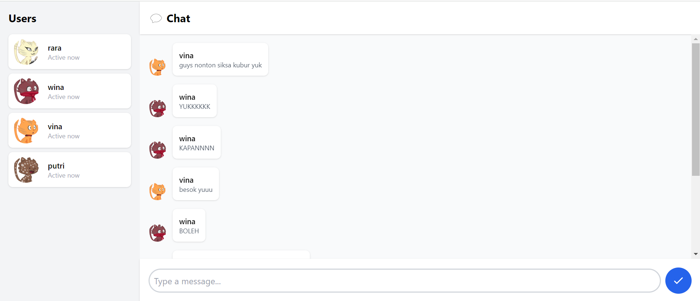
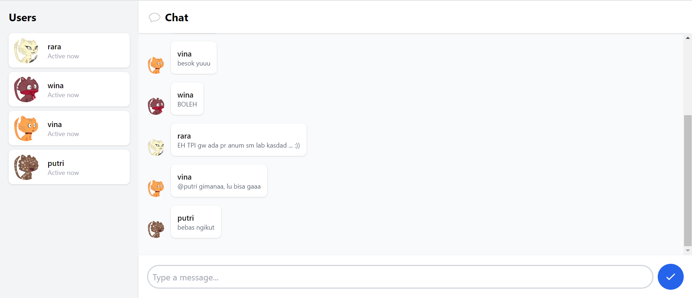

# Module 10: Asynchronous Programming
## Tutorial Advanced Programming 2023/2024 Genap

* Nama  : Tengku Laras Malahayati
* NPM   : 2206081641
* Kelas : A

## Reflection
### 3.1 Original Code

### 3.2 Add Some Creativities to The Webclient

I've implemented several enhancements to improve the visual appeal of this webchat interface. These include the 
use of compact chat bubbles for each message sent by users, the addition of randomly selected cat-themed avatars for 
user profiles, and various CSS modifications to enhance the overall layout. The result is not only more aesthetically 
pleasing but also way cuter!